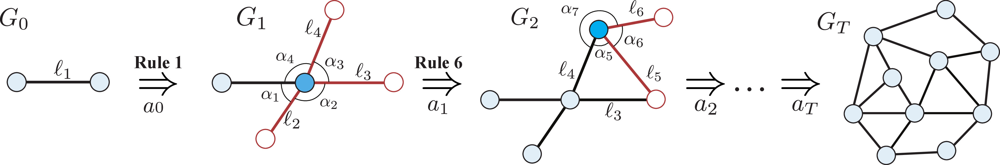
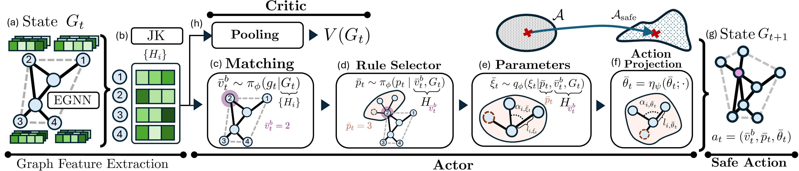
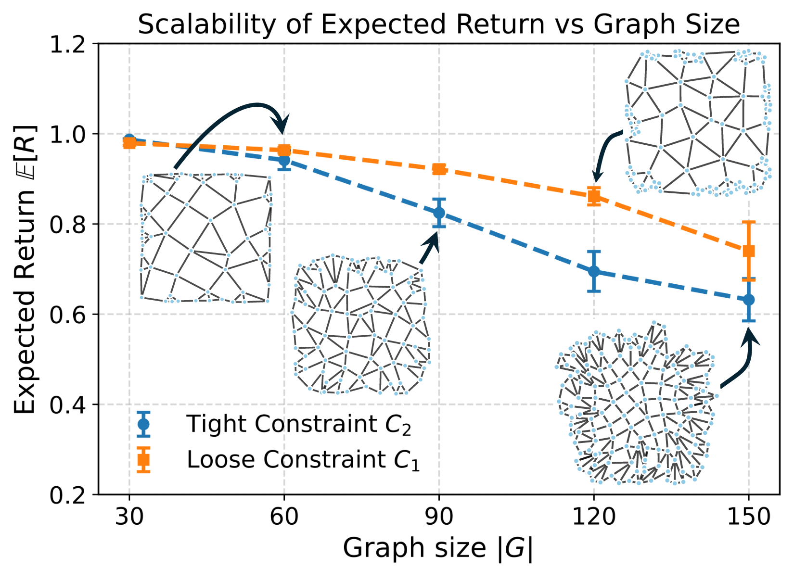

<h1 align="center">Constrained Goal-directed Planar Graph<br>Generation with Grammar-based Reinforcement Learning</h1>

<p align="center">
  Engineering Design and Computing Laboratory, ETH Zurich<br>
  <a href="mailto:nhochuli@ethz.ch">Nicolas Hochuli</a> &middot;
  <a href="mailto:lmiele@ethz.ch">Lorenzo Miele</a> &middot;
  Kristina Shea &middot; Tino Stankovic<br>
  <sub>Nicolas and Lorenzo contributed equally to this work.</sub>
</p>

<p align="center">
  <a href="https://openreview.net/forum?id=9Sh3SI4EF1"></a>
  <a href="pyproject.toml"></a>
  <a href="#installation"></a>
  <a href="LICENSE"></a>
</p>

<p align="center">
  <a href="#method">Method</a> &middot;
  <a href="#benchmarks">Benchmarks</a> &middot;
  <a href="#scalability">Scalability</a> &middot;
  <a href="#installation">Installation</a> &middot;
  <a href="#usage">Training</a> &middot;
  <a href="#baseline-evaluations">Baselines</a> &middot;
  <a href="#citation">Citation</a>
</p>


The paper studies **goal-directed generation of embedded planar graphs**: constructing both connectivity and node positions to match user-specified objectives while satisfying structural and geometric constraints.
The proposed approach combines a parametric graph grammar with a dataset-free reinforcement learning policy, allowing graph size and geometric, topological, and spectral targets to be specified directly.
Generation is formulated as a constrained Markov decision process, with feasibility checked at each graph transition.


<p align="center">
  <a href="docs/assets/graph-generation.png"></a>
  <br>
</p>

### Method

The actor encodes the current graph using an E(2)-equivariant graph neural network with Jumping Knowledge aggregation.
It then selects a boundary node $g_t$, a rewriting rule $p_t$, and continuous geometric parameters $\theta_t$.
For the action $a_t=(g_t,p_t,\theta_t)$, the policy factorizes as

$$
\pi_\phi(a_t\mid G_t)
=\pi_\phi(g_t\mid G_t)\,
\pi_\phi(p_t\mid g_t,G_t)\,
\pi_\phi(\theta_t\mid g_t,p_t,G_t).
$$

A separate graph encoder supplies the critic's state-value estimate $V(G_t)$, and the actor and critic are trained with Proximal Policy Optimization (PPO). A learned, state-dependent action projection transforms sampled continuous parameters toward geometrically feasible actions. Feasibility checks enforce edge-length bounds, minimum sector angles, maximum node degree, and an intersection-free planar embedding. When necessary, CMA-ES corrects geometric parameters; unsuccessful corrections and inadmissible discrete choices are rejected. These checks, together with correction and rejection, enforce feasibility rather than relying on the learned projection alone.


<p align="center">
  <a href="docs/assets/method.png"></a>
  <br>
</p>

### Goal-directed reward

The reward measures agreement with a set of target graph metrics $\mathcal{M}$ using the mean symmetric relative deviation:

$$
r(G)=1-\frac{1}{|\mathcal{M}|}
\sum_{m\in\mathcal{M}}
\frac{|\kappa_m^\star-\kappa_m(G)|}
{|\kappa_m^\star|+|\kappa_m(G)|+\epsilon}.
$$

Here, $\kappa_m^\star$ is the target value, $\kappa_m(G)$ is the measured graph metric, and $\epsilon>0$ ensures numerical stability.
A reward of one corresponds to matching all targets, while feasibility is enforced separately during construction.

### Scalability

The scalability study evaluates graphs with 30 to 150 nodes under tight and loose constraint sets.
Expected return decreases with graph size, with a larger drop under tighter constraints.

<p align="center">
  <a href="docs/assets/scalability.png"></a>
  <br>
  <sub>Scaling goal-directed generation across graph sizes and constraint settings.</sub>
</p>

---

## Installation

Install the dependencies with UV (make sure you have uv installed) by running the
command from the project root directory:
```bash
uv sync --locked
```

## Usage
To train the proposed method, run the following command:
```bash
uv run scripts/train_rl.py
```
from the project root. The hyperparameters, constraints and target metrics for training can be modified in
- conf/policy/ppo.yaml
- conf/constraints/default.yaml
- conf/target_metrics/default.yaml

Be aware that the first rollout takes way longer than the subsequent ones due to jit compilation of the 
grammar in JAX.


### Baseline Evaluations
To evaluate baseline methods, run the following command:
```bash
uv run scripts/find_best_graphs_for_targets.py
```
Ensure to install the Boltzmann generator by following the instructions at `ext/boltzmann-planar-graphs` using 
`uv pip install -e .`.

To run deep generative baselines, i.e. DiGress, GDSS with PRODIGY (in `code` directory) and MuDiff, see the respective 
Readme files  in the `ext` directory.

## Citation

If you use this code or method please cite us using:

```bibtex
@misc{hochuli2026constrainedgoaldirectedplanargraph,
title={Constrained Goal-directed Planar Graph Generation with Grammar-based Reinforcement Learning},
author={Nicolas Hochuli and Lorenzo Miele and Kristina Shea and Tino Stankovic},
year={2026},
eprint={2610.06244},
archivePrefix={arXiv},
primaryClass={cs.LG},
url={https://arxiv.org/abs/2610.06244},
}
```
